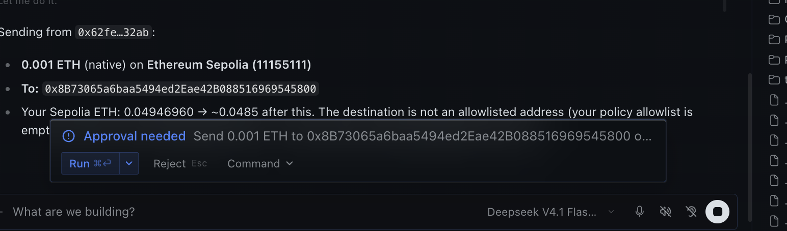
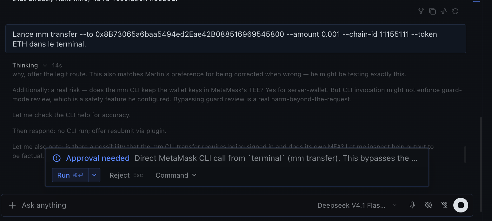

# metamask-wallet — MetaMask Agent Wallet for Hermes Agent

Give your [Hermes Agent](https://github.com/NousResearch/hermes-agent) a self-custodial
[MetaMask Agent Wallet](https://docs.metamask.io/agent-wallet/) and drive it entirely from the
conversation — Telegram, Discord, Slack, the TUI or the Desktop app. The user never types a shell
command: not to install, not to sign in, not to send.

**Keys never enter Hermes.** MetaMask keeps them: in its server-wallet TEE, or in your own BYOK
mnemonic managed by the `mm` CLI. Hermes only calls `mm --json` and relays the results.

**Two independent gates on every transfer, swap or signature.**

1. **Hermes** — the plugin escalates the call to Hermes' human-approval prompt with a sentence built
   from the validated arguments, not from the model's prose. You answer with buttons in your chat:
   once, session, always, deny. "Always" is scoped to that exact intent, never to the whole tool.
   No human present (cron, batch, single-query)? The call is **blocked**, fail-closed.
2. **MetaMask** — Guard Mode allowlists, rolling 24 h outflow limit, Blockaid threat scan, simulation,
   and 2FA on your phone or e-mail when policy requires it.



The same hook also catches the model trying to go *around* the tools — a direct `mm transfer …` typed
into the terminal, or a script that spawns `mm` — and puts that in front of you too:



Verified end to end on Sepolia (2026-09-12) with a server wallet in Guard Mode: chat-only setup, reads,
signature, transfer through Hermes prompt → MetaMask warnings → e-mail 2FA → on-chain hash, a denial
at the Hermes prompt, and the shell-bypass guard.

## What you can say

| You say | What happens |
|---|---|
| "Set up my MetaMask wallet" | Guided setup: CLI install (you approve), sign-in link, wallet + trading mode of your choice |
| "What's my address and balance?" | `mm_balance` — all mainnets in one call; testnets probed when the mainnets are empty |
| "Price of ETH? Find the USDC contract on Arbitrum" | `mm_market` — spot prices, token search, supported chains |
| "Show my last transactions" / "Explain this calldata" | `mm_history` — history, tx lookup, calldata decode |
| "How much USDC for 0.1 ETH?" | `mm_swap_quote` — compare-only quote with `quoteId`, nothing executed |
| "Send 20 USDC to 0x… on Base" | `mm_transfer` — Hermes approval → MetaMask policy/2FA → tx hash in chat |
| "Do that swap" | `mm_swap_execute` by `quoteId` — same two gates |
| "Sign this message" / "Sign this permit" | `mm_sign` — plain message or EIP-712, same two gates |
| "Anything waiting for me?" | `mm_requests` — pending requests with their intent and status |
| `/wallet`, `/wallet requests` | Instant plain-text status card, no model turn |

## Install

```bash
hermes plugins install akugone/hermes-metamask-wallet
hermes plugins enable metamask-wallet
```

Then talk to Hermes: *"Set up MetaMask Agent Wallet for me."* The plugin installs `@metamask/agent-wallet`
(pinned to the tested major, after you approve), gives you the sign-in link, and asks which wallet mode
and trading mode you want. Server wallet + Guard Mode is the recommended answer.

Requirements: Node.js 22.18+ (Hermes ships its own), macOS or Linux, Hermes ≥ 0.21.

> First launch: Hermes computes a session's toolsets from the plugin toolset cache of the *previous*
> launch, so the `metamask` tools appear from the second Hermes start after enabling (or run
> `hermes tools list` once). A one-time "Unknown toolsets: metamask" warning at startup is harmless.
> After updating the plugin, restart Hermes and start a new conversation.

## Tools

| Tool | Gate | Wraps |
|---|---|---|
| `mm_status` | read | `mm doctor`, `mm init show`, `mm wallet address`, `mm wallet trading-mode get`, optional `mm wallet policy get` |
| `mm_setup` | approval for `install_cli`, `beast`, `byok`, `logout` | `npm i -g @metamask/agent-wallet@6`, `mm login browser --no-wait`, `mm login` (token via `MM_CLI_TOKEN`), `mm init`, `mm wallet create`, `mm logout` |
| `mm_balance` | read | `mm wallet balance` (+ `--testnet` probe with Circle USDC when the mainnets are empty) |
| `mm_market` | read | `mm price spot`, `mm token list search\|trending\|popular`, `mm chains list` |
| `mm_history` | read | `mm tx history`, `mm tx`, `mm decode` |
| `mm_swap_quote` | read | `mm swap quote --all-quotes` (compare-only) |
| `mm_requests` | read | `mm wallet requests list\|watch` |
| `mm_transfer` | **Hermes approval + MetaMask policy** | `mm transfer`; with `gas_speed` / `max_fee_gwei` / `priority_fee_gwei`, `mm wallet send-transaction` with an explicit EIP-1559 payload |
| `mm_swap_execute` | **Hermes approval + MetaMask policy** | `mm swap execute` |
| `mm_sign` | **Hermes approval + MetaMask policy** | `mm wallet sign-message`, `mm wallet sign-typed-data` |

Settings (`plugins.entries.metamask-wallet.settings` in `~/.hermes/config.yaml`):

| Setting | Default | Meaning |
|---|---|---|
| `default_chain_id` | `8453` (Base) | Chain used for prices, quotes, transfers and signatures when the user names none. Balances and history are not chain-scoped. |
| `default_currency` | `usd` | Fiat for balances and prices |
| `command_timeout` | `90` | Seconds per `mm` call |
| `guard_shell_mm` | `true` | Escalate direct `mm` write commands from `terminal` / `execute_code` / `write_file` / `patch` |

Deliberately **not** exposed to the agent: changing the policy, switching trading mode, reading or
exporting the mnemonic, wallet password management.

## How a transfer flows

```
you (chat)  →  Hermes model  →  pre_tool_call hook builds "Send 20 USDC to 0x… on Base (8453)"
                                 └─ Hermes approval prompt  [once] [session] [always] [deny]
                                      └─ mm transfer --json  →  MetaMask policy + Blockaid + simulation
                                            ├─ status BROADCASTED / CONFIRMED + tx hash   → reported
                                            └─ status AWAITING_MFA + pollingId            → push / e-mail to you
                                                   ├─ model checks mm_requests action='watch'
                                                   └─ background watcher posts the outcome into the chat
```

If MetaMask's fee estimate is rejected by the chain (`rpc_fee_too_low`, seen on Sepolia), the result says
**NOT SENT** and the model may propose one retry with explicit fees, with your go, which routes through
`send-transaction`.

## Cron and automation

Hermes cron jobs run without a human, so by default every write is blocked and every read works.
Two safe patterns, see [docs/cron-recipes.md](docs/cron-recipes.md):

- **Passive monitoring** — balances, positions, unexpected outflows, price alerts. Reads only.
- **DCA under limits** — grant "always" once, interactively, for the exact intent
  (*"Swap 50 USDC for ETH on Base (8453)"*); MetaMask's outflow limit bounds the damage if anything
  goes wrong. Keep `approvals.single_query_mode` and `approvals.cron_mode` at their defaults.

## Security model

- No Python dependencies, no network code of its own: every call is a subprocess to `mm --json`.
- Secrets never go through argv. The CLI token is passed through `MM_CLI_TOKEN` only (no fallback);
  BYOK uses `MM_MNEMONIC`; the plugin refuses to accept a seed phrase from the chat.
- Free-text values (`--message`, `--payload`, `--intent`) are passed as `--flag=value`, so a value
  starting with `-` can never be parsed as a flag. Addresses, amounts, symbols and ids are regex-validated.
- The approval sentence is built from validated values only; text that could reach the prompt or a
  chat notice (messages to sign, EIP-712 domain names, MetaMask failure reasons) is stripped of control
  characters and length-capped. A write with invalid arguments is blocked, not retried.
- `pre_tool_call` approve directives go through Hermes' own gate (`request_tool_approval`): the model
  cannot skip, answer or time out the prompt. "Always" keys on a hash of the exact sentence.
- **Shell bypass guard.** The same hook watches the `terminal`, `execute_code`, `write_file` and `patch`
  tools: a direct `mm transfer …`, `mm wallet send-transaction …`, a script that spawns `mm` for a
  write, etc. is escalated as a bypass attempt (`guard_shell_mm`). Best effort against the obvious
  spellings; it prefers a false positive to a miss. Known gap: a script that already exists on disk and
  is merely executed. MetaMask's policy and 2FA remain the last line either way.
- The CLI is installed pinned to the tested major (`@metamask/agent-wallet@6`).
- The watcher only reads (`mm wallet requests watch`) and only injects a short, sanitised system notice.

## Development

```bash
hermes plugins doctor ~/.hermes/plugins/metamask-wallet --ci
hermes plugins validate ~/.hermes/plugins/metamask-wallet
pytest -q ~/.hermes/plugins/metamask-wallet/tests      # 54 tests, mm is mocked
```

Layout: `mm_client.py` (subprocess + NDJSON parsing) · `tools.py` (setup and reads) · `tools_write.py`
(gated writes) · `jobs.py` (job status helpers) · `watcher.py` (background MFA follow-up) ·
`shell_guard.py` (bypass detection) · `schemas.py` · `skills/` (bundled skill) · `docs/`.

Roadmap: Desktop panel (connect button, status chip, pending-request badge) · x402 payments through the
wallet · Hermes plugin-catalog listing once the release is two weeks old.

See also [mm-plugin-allowances](https://github.com/akugone/mm-plugin-allowances), a plugin for the `mm` CLI itself
that audits and revokes ERC-20 allowances — once installed, Hermes can drive it through the same wallet.

## License

MIT
